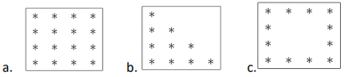

# Prática 07
O objetivo da realização desses exercícios é proporcionar uma oportunidade de aplicar os conceitos de estruturas de controle em C++, desenvolver habilidades de resolução de problemas mais complexos e aprimorar a compreensão da lógica de programação.
## Exercício 01 - FizzBuzz
Programa em C++ que imprime na tela os números de 1 a 100, levando em consideração o seguinte:
- Para os múltiplos de 3, o programa imprime "Fizz".
- Para múltiplos de 5, imprime "Buzz".
- Para números que são múltiplos de ambos, imprime "FizzBuzz".
## Exercício 02 - Palíndromo
Programa que lê um número inteiro e verifique se ele é um palíndromo.
Um palíndromo é um número que permanece o mesmo quando seus dígitos são invertidos.
## Exercício 03 - Divisores 
Programa que lê um número inteiro do usuário e imprime todos seus divisores.
## Exercício 04 - Números primos
Programa que imprime todos os números primos de 1 a 100.
## Exercício 05 - Jogo de adivinhação
Programa que vai gerar um número aleatório entre 1 a 100 para o usuário tentar acertar.
- O jogo informa se o palpite está alto, baixo ou correto.
- O jogo só termina quando o usuário acerta o número.
## Exercício 06v1 - Média dos alunos
Programa que vai receber a matrícula dos alunos e três notas. Para cada aluno cadastrado, o programa pergunta se deseja continuar.
## Exercício 06v2 - Escada alfabética
Programa que vai gerar um padrão de caracteres que formam uma escada, onde o usuário vai entrar com a altura desse padrão. Para o exemplo abaixo a entrada foi 5:
A
BC
DEF
GHIJ
KLMNO
## Exercício 07 - Gerar padrão com asteriscos
Programa que recebe um valor inteiro representando a altura e vai ter como saída os seguintes padrões: 

Nos exemplos acima, a entrada foi 4.
## Exercício 08 - Número perfeito
Programa que vai ler um número e determinar se ele é um número perfeito, ou seja, um número cuja soma dos seus divisores, excluindo ele mesmo, é igual ao próprio número.
## Exercício 09 - Sequência de Fibonacci
Programa que vai imprimir a sequência de Fiboancci até o número fornecido pelo usuário
## Exercício 10 - Número armstrong
Programa que recebe número inteiro e verifica se ele é um número armstrong. 
- Um número armstrong é um número que é igual a soma de seus próprios dígitos elevados à quantidade de dígitos.
- Por exemplo, 153 é um número armstrong porque 1^3 + 5^3 + 3^3 = 153.
